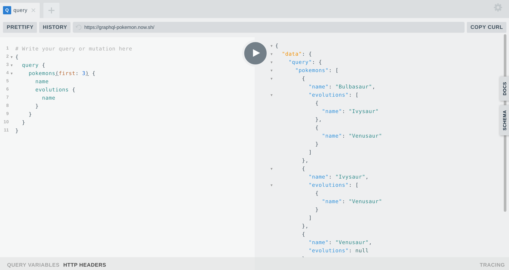

# Playground
Minimalist server that exposes a Graphql Playground interface to interact with your schema



# Usage

### With docker
```bash
docker build . -t playit
docker run -it -p 4040:4040 --init \
-e GRAPHQL_API_ENDPOINT=http://localhost:8080/graphql playit
```

### With npm
```bash
npm install
node app.js
```